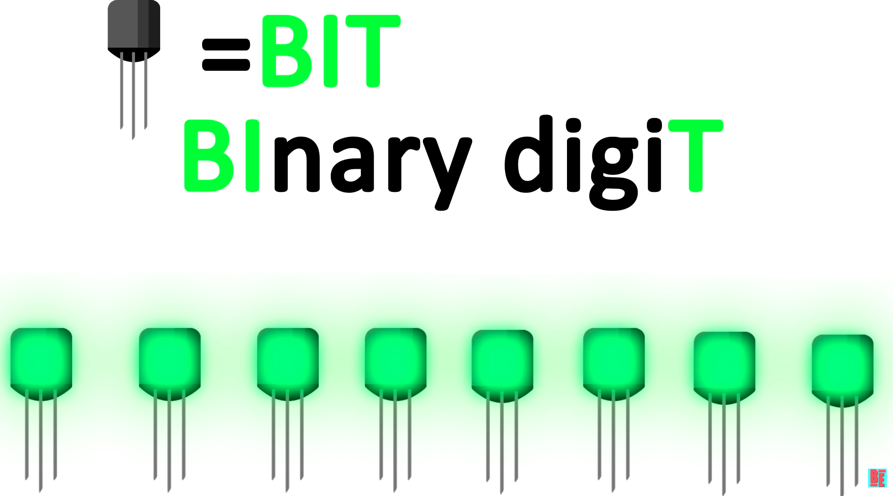
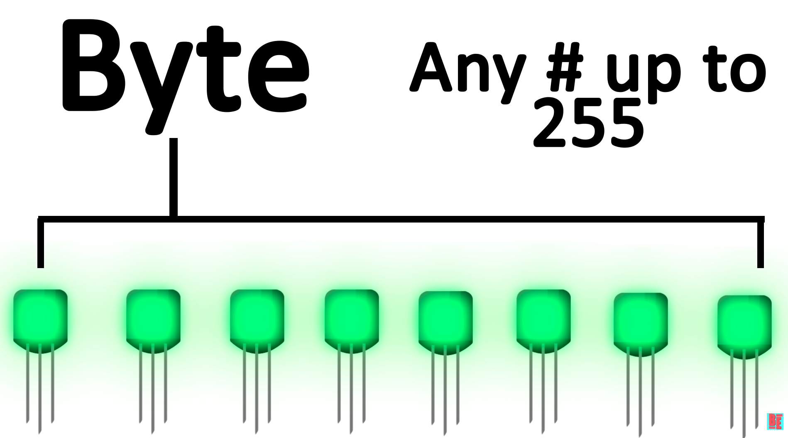
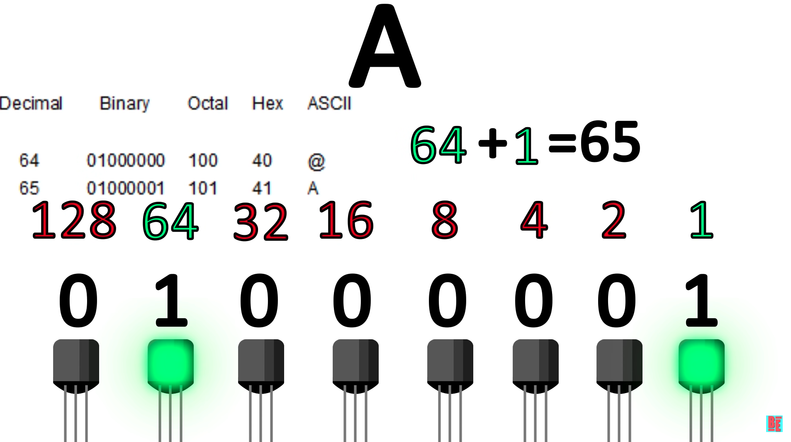
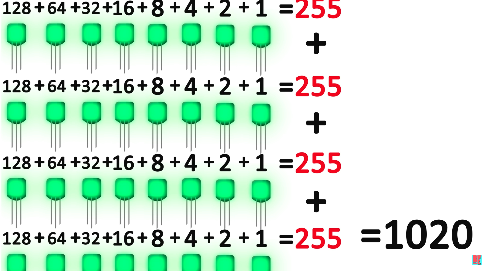
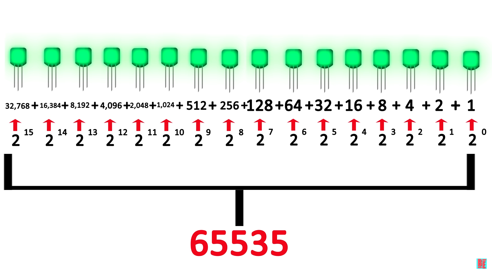

# Bit Arithmetic

## Foundation

### Bits

- A bit is one transitor that can be turned on/of
- In this picture there are 8 bits

### Byte

- A byte is a collection of bits
- In this picture 8 bits make up 1 byte

### ASCII

- ascii stores all the characters on keyboard into one byte
- so the combination of bits in a bte allow up to **255** different characters
- In this image **A** represents the number **65** which in binary which is **01000001**

---

## Problem

- Became resource heavy to do more complex task using transitors
- Computers could only use **255** numbers as for a byte
- And using 4 bytes could use **1020** as the highest number

## Solution

- Now computers can use **2 bytes** to represent one number
- So now a **byte** could contain **16 bits**
    - this is where you hear 8-bit and 16-bit games
    - 32-bits is the most common for most computer programs
- Increased exponentialy from ***255*** to ***65,535***

images/Screenshot_2023-05-10_at_12.56.37_PM.png
---

## Counting Bits

There are two common methods for counting bits:

1. Using powers of 2: Each bit has a value equal to 2 raised to the power of its position, starting from 0. For example, in a 8-bit number, the rightmost bit (position 0) has a value of 2^0 = 1, the next bit to the left (position 1) has a value of 2^1 = 2, and so on, up to the leftmost bit (position 7) which has a value of 2^7 = 128. To count the value represented by the number, simply add up the values of all the bits that are set to 1.
2. Adding each place: Start from the rightmost bit and assign each bit a place value of 1, 2, 4, 8, 16, 32, 64, and 128 (for an 8-bit number). Add up the values of all the bits that are set to 1 to get the value represented by the number.

### **Here's a cheat sheet for the values of each bit in an 8-bit number:**

128 - - 64 - - 32 - - 16 - - 8 - - 4 - - 2 - - 1

| Bit Value | Bits Representation |
| --- | --- |
| 1 | 00000001 |
| 2 | 00000010 |
| 4 | 00000100 |
| 8 | 00001000 |
| 16 | 00010000 |
| 32 | 00100000 |
| 64 | 01000000 |
| 128 | 10000000 |

### Example:

- Start from left to right
- Remember to count the places remeber each plce is 2X higher then the next place

01101001 = 105

1 + 0 + 0 + 8 + 0 + 32 + 64 + 0 = 105
